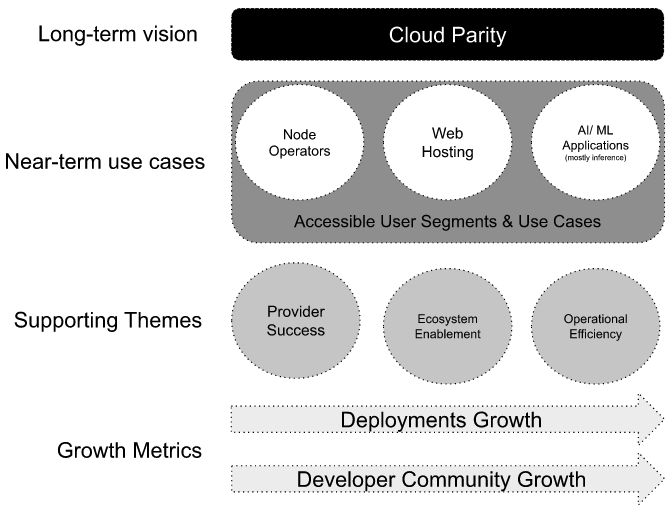
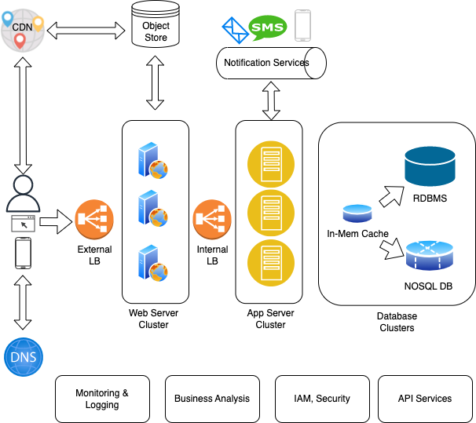
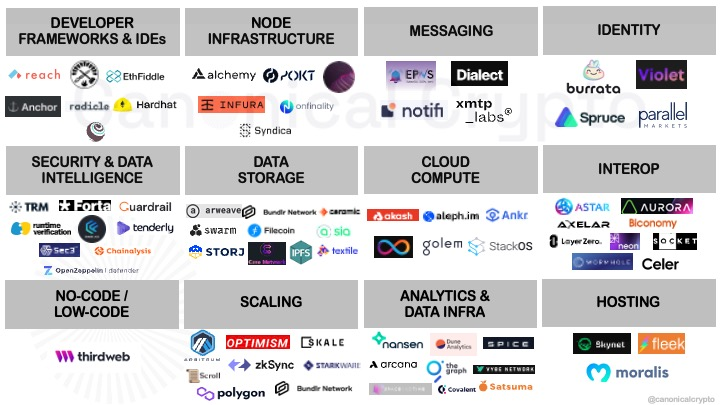
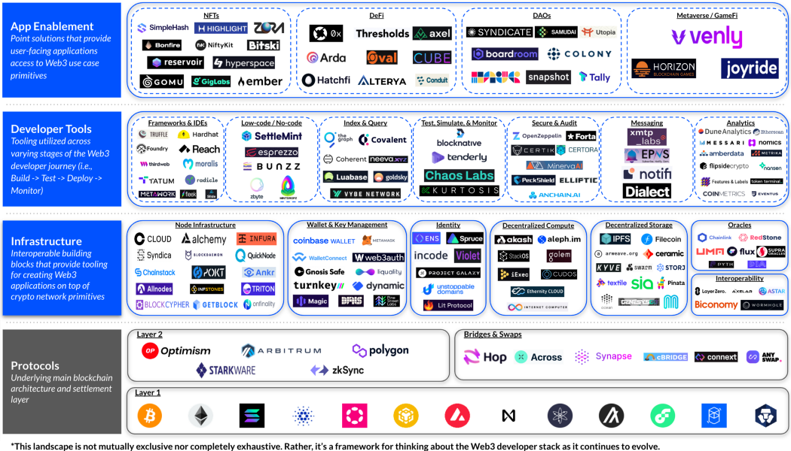

# Akash Network Product Strategy & Execution

## Summary

Akash Network and its community are focussed on the long-term goal of building a viable decentralized alternative to the large centralized public clouds. In the short-term, the community is focused on the needs of a subset of public cloud users that we think are most easily accessible to it and building features that make those users successful on Akash Network. Today these user groups are:

- Users running nodes in public clouds, for proof-of-stake blockchains.
- Users hosting websites on public clouds or PaaS solutions (like vercel or netlify) that rely on public clouds, and;
- AI/ML application developers that tune a previously trained AI model and/ or run AI inference on public cloud infrastructure.

## Product Strategy

Akash Network’s vision is to become a viable alternative to today’s centralized public cloud infrastructure, including supporting the largest web scale & enterprise applications that run on them.

The success of Akash Network’s product and market efforts will be indicated by two main metrics:

- Growing active deployments (first time users and repeat users) on Akash Network of workloads that would otherwise run on centralized public cloud platforms.
- Building and nurturing a thriving developer community to drive product development with Community Groups.

Akash Network has identified 2 primary themes and 3 secondary themes that will serve as guardrails to help prioritize features that help us achieve the above objectives. Any features or products we decide to build should generally align with furthering the above goals and fit within the themes identified below. While there will be use cases that don’t fit within these that Akash Network can and will be used for, we will NOT make a concerted effort to prioritize them when it comes to our product roadmap.

### Primary Themes

**Cloud Parity**: This is a very broad and lofty goal that will take several years to fully realize. In order to ensure that we are making progress towards it in a meaningful way, we identify a specific subset of use cases that we can satisfy in the short term (the second theme below) that today rely on public clouds for their needs.

**Accessible Users & Use Cases**: Use cases and user segments that we can reach most easily in the near term that are today dependent on public clouds. If done right, satisfying these use cases, automatically also moves the needle towards closing the gap towards “cloud parity”.

### Secondary Themes

These are themes that support the primary objectives
**Provider Success**: Features that make provider onboarding, pricing, monitoring and management easy, so as to incentivize new providers to join Akash Network, thereby increasing the value that tenants deploying on Akash get.
**Operational Efficiency**: Everything related to improving Akash Networks’ code base and mainnet upgrade process to enable software releases on a regular basis.
**Ecosystem Enablement**: Features necessary to unlock partnerships with other web3 projects, that fill gaps in things needed to achieve the primary objectives.

### Cloud Parity

Traditional cloud platforms’ (AWS, Azure and GCP) strategy has been focused on building the “core pieces” of infrastructure necessary to run a web scale application in production, before deciding to offer specialized services (big data, AI training models, IoT, blockchains etc). What does this mean specifically?

The typical modern, cloud native, web application architecture (simplified) looks something like this:

The big cloud providers provide services for every one of the elements shown above. Trying to build an equivalent offering for the services offered by the cloud providers today is going to be near impossible and isn’t even the right strategy for a team building with an open source community in a decentralized fashion. Instead, we’re better off focusing on just compute (for powering web servers, app servers, load balancers, db instances etc) and partnering with others for things like managed services. For example, for Object Storage AWS offers S3, Azure has “Blob storage” and GCP has “Cloud Storage”. There are also equivalent decentralized solutions to this like IPFS (filecoin) and StroJ. Our goal should be to ensure that it is easy enough for a user of Akash, to be able to utilize any of those solutions with Akash compute.

The ecosystem of web 3 equivalents for various web2 cloud primitives and managed services is as shown in the below images. We already have some active partnership discussions with a few partners including StorJ, Fleek and ThirdWeb.

The work to build out cloud parity with ecosystem partners will include:

1. Maintaining a list of services (centralized or decentralized) that we see users commonly need (this is where focusing on specific use cases is important).
2. Understanding and documenting integration points for both the decentralized and the centralized options.
3. Building reference applications for how to build a web app that runs other services (redis, postgres, S3 etc) on Akash compute.
4. Build features that enable High Availability (HA), Scalability and other foundational elements, required by users running production applications at scale in existing clouds before they consider migrating to Akash.

### Accessible Users & Use Cases

Akash Network has identified the following 3 use cases and associated user segments that we think we are able to reach and that will drive growth in deployments significantly. Part of our work is to fully flesh out the product requirements for each of these use cases with representative users from the segments and offer them a way to migrate from centralized cloud providers to Akash Network.

#### Node Deployments

Akash Network sees strong interest and traction for node operators wanting to run on Akash. We intend to prioritize chains within the Cosmos ecosystem initially and look at other ecosystems (Ethereum, Solana, others) opportunistically. Our market strategy here is to follow a 3 step approach, in increasing technical difficulty:

- **Phase1 - RPC Nodes:** spinning up RPC nodes is a low lift for us and Console is optimized for this with templates.
- **Phase2 - Validator Nodes for testnets:** Focusing on validators for testnets lets us be able to make progress without having all the reliability and high availability features.
- **Phase3 - Validator Nodes for mainnets:** We have to provide some SLAs before we can attract this user group since there is the risk of people getting slashed if their node goes down.

#### Website hosting

Website hosting is a great use case for the following reasons:

- All web3 startups have websites and based on several conversations they use web2 products like vercel today.
- Many are static webpages with simple hosting requirements compared with larger enterprise web applications.
- Gaining traction with this user segment and then having fiat payments would allow us to take this to non crypto/ web3 companies.

#### AI & ML Workloads

AL/ ML applications represent a huge growth area for cloud services in the next decade and the demand for GPUs is going to skyrocket. Akash Network is poised to service this demand by connecting the available GPU capacity in various datacenters and mining operations. We intend to focus on Inference and some training (mostly for tuning a base mode) and not on base training. There will be a lot of work necessary to realize this, but some of the high level initiatives will include:

- GPU support on the Akash marketplace (Provider and Client/ SDL)
- Workflows for containerizing and running ML apps built in the most common languages and frameworks.
- Integration with ML datastores to provide easy access to training data sets.
- GPU inventory buildup

## Execution Framework

Akash Network’s execution framework uses a community based development model that borrows a lot of the principles from the way the open source [Kubernetes project](https://github.com/kubernetes/community) operates . In general our execution framework, includes the following:

- Different groups of community members that work on projects that advance Akash Networks’ mission. This is documented in [Community Groups](../cg-list)
- A prioritized pipeline of ideas/ projects we would like built, bucketed by - themes. This is kept up to date on a regular (weekly/monthly) basis. This is outlined in the [Projects List](../projects-list/README.md)
- Documented places to discuss/ publish/ comment/ review/ approve the specifications for each projects listed in #1 above. This is outlined in Data Organization and Repositories
- States that a given project can be in. Outlined in [Project States](../projects-list/README.md)
- Meetings to regularly discuss prioritization of list of projects and meetings with individual project teams to make sure each project moves forward. Meetings page and notes will be documented in Github as noted in Data Organization and Repositories.
